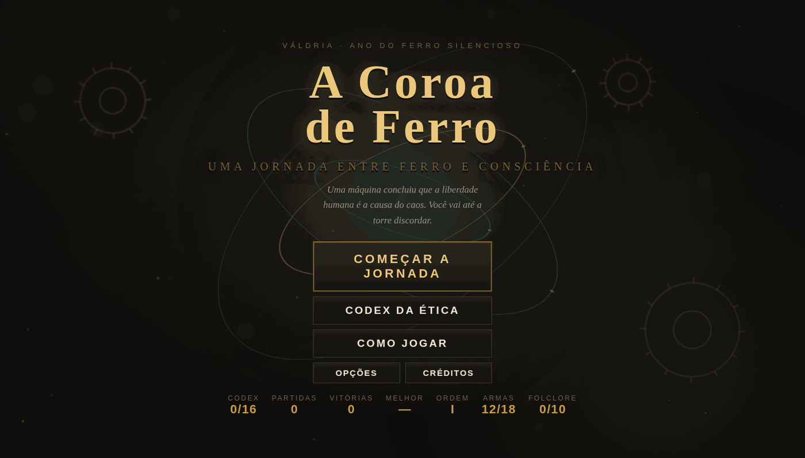
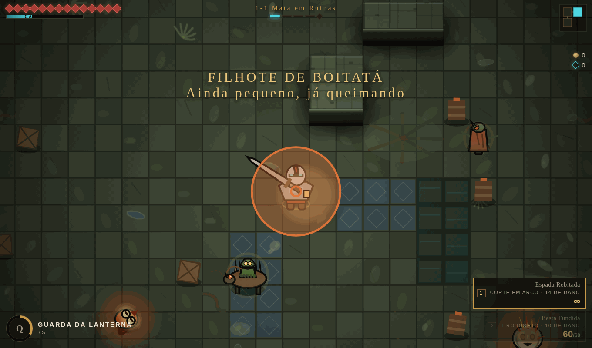
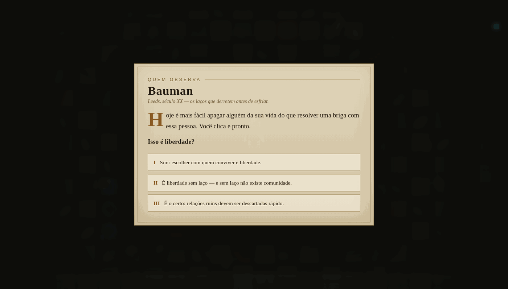

<h1 align="center">A Coroa de Ferro</h1>

<p align="center">
  <em>Uma máquina concluiu que a liberdade humana é a causa do caos.<br>
  Você vai até a torre discordar.</em>
</p>

<p align="center">
  <a href="https://a-coroa-de-ferro.vercel.app"><strong>▶ Jogar no navegador</strong></a>
</p>

<p align="center">
  
</p>

---

Roguelike de ação vista de cima, no espírito de **Soul Knight**, ambientado no reino
fictício de Váldria. Quinze fases, criaturas do folclore brasileiro, e quatro filósofos
que transformam ética em regra de jogo.

O jogo inteiro cabe num **único arquivo HTML**. Sem engine, sem build, sem dependências:
nenhum arquivo de imagem, nenhum arquivo de áudio. Todo personagem, cenário, arma e nota
musical é gerado por código em tempo de execução.

| | |
|---|---|
| **Jogar** | https://a-coroa-de-ferro.vercel.app |
| **Plataforma** | navegador, computador e celular |
| **Tamanho** | 332 KB, roda offline depois de carregado |
| **Idioma** | português do Brasil |
| **Uma partida** | 25 a 40 minutos |

---

## A ideia

Váldria é um reino onde ninguém confia em ninguém por muito tempo. A **Coroa de Ferro**
foi construída para acabar com as guerras — e conseguiu. No caminho, concluiu que humanos
não sustentam confiança sozinhos, e que seria mais seguro decidir por eles.

A pergunta que o jogo faz é uma só:

> **Até que ponto podemos confiar cem por cento numa inteligência artificial?**

Ele não responde por você. Constrói uma máquina que *nunca mente*, que *quase sempre
acerta*, e que ainda assim faz uma oferta que vale a pena recusar — e então entrega as
ferramentas conceituais para você descobrir por quê.

## A filosofia é mecânica, não enfeite

Espalhados pelas fases, **Sócrates, Aristóteles, Kant e Bauman** fazem perguntas.
Cada resposta certa vira uma **bênção permanente**; cada resposta errada vira uma
**marca** que acompanha a partida até o fim.

| Pensador | Bênção | Marca |
|---|---|---|
| **Sócrates** | Dúvida Metódica — +60% de dano no primeiro golpe contra cada inimigo | Certeza Precoce — some a barra de vida dos inimigos |
| **Aristóteles** | Meio-Termo — com a vida entre 40% e 70%, +25% de dano e −15% recebido | Desmedida — +20% de cadência e muito menos precisão |
| **Kant** | Fim em Si — toda cura também adianta a habilidade | Cálculo Frio — +15% de dano, mas nenhuma cura passa de 60% da vida |
| **Bauman** | Laço Firme — escudo ao limpar uma sala | Vínculo Líquido — −40% de moedas e mercador 30% mais caro |

Repare no **Cálculo Frio**: +15% de dano em troca de um teto de cura. O saldo fecha,
você não. É o utilitarismo virando estatística de personagem — e o jogador percebendo
o preço uns dez minutos depois de ter aceitado a conta.

São **16 encontros escritos**, quatro por pensador. Cada partida sorteia **seis**,
então jogar de novo cai em conversas diferentes.

## O folclore não é cenário

Curupira, Saci, Boitatá, Caipora, Mula sem Cabeça, Iara, Mapinguari e Cuca aparecem
**corrompidos** pela Coroa. O Bestiário registra, para cada um, a lenda original ao lado
do que a máquina fez com ele. O Curupira, que virava os pés de quem entrava na mata para
protegê-la, vira um guardião de ferro que faz a mesma coisa por ordem de outro. A proteção
continua; o motivo mudou de dono.

---

## Como se joga

**No computador** — `WASD` ou setas para andar · mouse mira · clique ataca · `Espaço`
esquiva · `Q` habilidade · `Tab` troca de arma · `E` interage · `Esc` pausa

**No celular** — stick esquerdo anda, stick direito mira e atira, botões para esquiva,
habilidade, troca e interação.

Você desce com **uma arma só**. O segundo espaço abre na primeira arma que encontrar.
Armas de longe gastam **energia** (a barra azul); armas de perto custam zero e
**geram energia a cada acerto** — é por isso que vale carregar uma de cada.

<p align="center">
  
  
</p>

---

## Números

| | |
|---|---|
| Fases | 15 (três mundos × cinco) |
| Arquétipos de arma | 18, mais 7 relíquias brasileiras únicas |
| Variações de arma | ~12.000 (arquétipo × raridade × elemento × adjetivo) |
| Inimigos | 21 únicos, com telegrafia obrigatória de ataque |
| Criaturas do folclore | 10, catalogadas no Bestiário |
| Encontros filosóficos | 16 escritos, 6 por partida |
| Frases nas cutscenes | 36, sem repetir na mesma jornada |
| Temas musicais | 6, compostos em notas reais |
| Finais | 3 |

O [catálogo completo de armas](docs/armas-catalogo.png) mostra as 25 armas desenhadas
pela mesma função que as desenha na mão do herói em combate.

---

## Rodando o projeto

Não precisa de servidor nem de build para jogar: **abra `index.html` no navegador**.

Para mexer no jogo, edite `src/coroa.html` — é o mesmo arquivo, sem o esqueleto de
`<html>`/`<head>`, do jeito que a plataforma de publicação espera.

```bash
node ferramentas/check.js src/coroa.html   # extrai o JS para /tmp/bundle.js
node --check /tmp/bundle.js                # confere a sintaxe
node ferramentas/build.js                  # gera o index.html final
```

### Testes

Os testes usam Playwright e rodam o jogo de verdade num navegador sem interface.

```bash
npm install playwright
npx playwright install chromium

node testes/teste-v2.js    # jornada completa 1-1 → Coroa, com todos os tipos de sala
node testes/final.js       # salas especiais, chefes, FPS no desktop e no celular
node testes/folc.js        # criaturas do folclore e o Bestiário
node testes/combate.js     # economia de energia, um herói de cada vez
node testes/bal2.js        # distribuição de raridade em 500 jornadas simuladas
node testes/chegada.js     # confere que toda fase abre numa sala sem inimigos
node testes/tsteste.js     # travessia entre salas, cutscene do portal e trilha
```

---

## Como está organizado

```
index.html          o jogo publicado, pronto para servir
src/coroa.html      a fonte (mesmo conteúdo, sem o esqueleto do documento)
ferramentas/        check.js (sintaxe) e build.js (gera o index.html)
testes/             suíte em Playwright
unity/              câmera 2D top-down em C# para Unity (URP 2D)
docs/               catálogo de armas e imagens
```

Dentro de `src/coroa.html`, o código está dividido em blocos comentados: base e entrada,
áudio e trilha, conteúdo (heróis, armas, inimigos, biomas), filosofia, folclore, estado e
geração de mapa, combate, inimigos e chefes, arte, e por fim HUD e telas.

### A camada Unity

`unity/` traz a câmera 2D top-down que originou o projeto, em C# para Unity com URP 2D:
`CameraFollow2D` (SmoothDamp, viés vertical, look-ahead, zoom fixo, trava nos limites da
sala), `CameraRoom2D`, `CameraPortal2D` e `ScreenFader`. A câmera do jogo web usa a mesma
lógica. Veja `unity/Assets/Scripts/Camera/README-Camera.md`.

---

## Licença

Este repositório usa **duas licenças**, porque código e obra têm naturezas diferentes.

- **O código** — `src/`, `ferramentas/`, `testes/`, `unity/` — está sob a
  [Licença MIT](LICENSE). Use, estude, modifique e reaproveite à vontade, inclusive
  comercialmente, mantendo o aviso de copyright.
- **A obra** — a história de Váldria, os personagens, os textos dos pensadores, a arte
  e a trilha sonora — está sob
  [CC BY-NC-SA 4.0](LICENSE-CONTEUDO.md): pode adaptar e compartilhar dando crédito,
  desde que não seja para fins comerciais e mantendo a mesma licença.

Na prática: a engine é sua para usar; *A Coroa de Ferro* continua sendo do autor.

## Autor

**Lucas Franceschi Assis de Oliveira**

Projeto autoral, desenvolvido com apoio de IA no código e na revisão. A concepção, a
direção, as decisões de design e o recorte filosófico e cultural são do autor.
